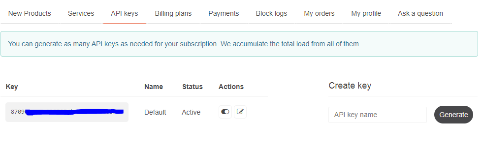
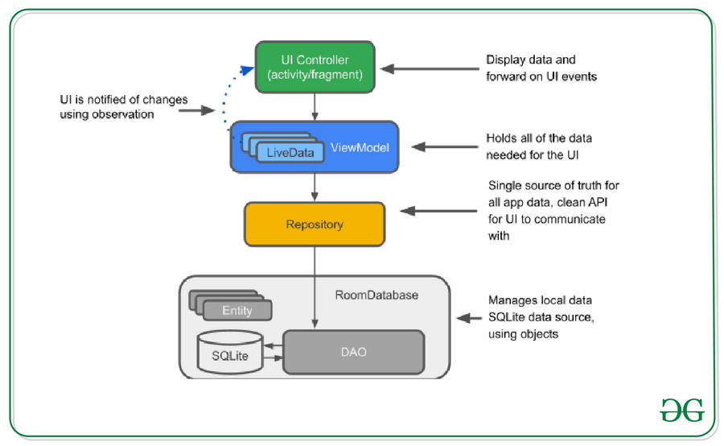

    

<h3 align="center">Weather app for Android</h3>
<h4 align="center">Weather + note app</h4>

## Table of Contents
- [Requirements](#installation)
- [Project Motivation](#motivation)
- [Project Overview](#po)
- [Demo](#kip)
- [Licensing, Authors, and Acknowledgements](#licensing)

## Requirements 
If you want to use this app, make sure first to go to the [openweather](https://openweathermap.org/) and signup using your Google account, then go to the API and create your API (get your api key the free version, you will find it in the my api key).

  

After you retrieve your API Key add it in the MainActivity.java file in line 41:

  

## Project Motivation 

This is a personal project relised using java for an android app of a weather/note app.

  
### Project Overview 

This project has two parts a weather part and a note part.
The weather part is created using the openweather API.
The note app is created with the MVVM architecture (Model-View-ViewModel) where the RoomDatabase is used (SQLlite)

  

## Demo 

https://user-images.githubusercontent.com/76624013/228084770-45c5cef6-ace0-4589-af18-ec5eee15db1b.mp4

## Licensing, Authors, Acknowledgements
If you use the source code in futur work, please mention us!!!.
